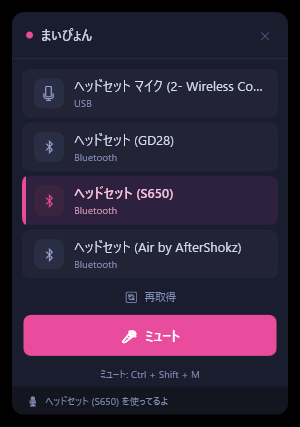
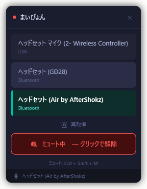
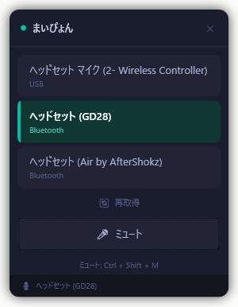

# まいぴょん 🎙

Windowsのタスクトレイに住んでる、マイク切り替え＆ミュートツールだよ。  
サウンド設定を開かなくても、ワンクリックでマイクが切り替えられる！

 

---

## 作った理由

Windowsってマイクをさっと切り替える方法がないんだよね。  
Bluetoothヘッドセットと別のマイクを行き来するたびに、サウンド設定 → 入力タブ → デバイス選択…ってクリックしまくらないといけなくて、めんどくさすぎる。  
だから作った。

---

## できること

- **タスクトレイ常駐** — 常にトレイにいて、いつでもワンクリック
- **左クリックでミュートトグル** — トレイアイコンをクリックするだけ
- **右クリックでマイク切り替え** — ワンクリックでデフォルトマイクを変更
- **フローティングウィンドウ** — ダークテーマのパネルでマイク一覧を表示
- **グローバルホットキー** — どこにいてもミュート切り替え（デフォルト: `Ctrl + Shift + M`、変更もできるよ）
- **接続タイプ表示** — USB / Bluetooth / 3.5mm を表示
- **使用中デバイスのグレーアウト** — 別のアプリが使ってるマイクは薄く表示して「切り替え不可」ってわかるようにしてる
- **デバイス非表示** — 使わないマイクをリストから消せる
- **二重起動防止** — 1個だけ起動

---

## 動作環境

- Windows 10 / 11
- .NET 10 ランタイム（[ここからダウンロード](https://dotnet.microsoft.com/download/dotnet/10.0)）

---

## インストール

1. [Releases](../../releases) ページから最新版をダウンロード
2. `まいぴょん.exe` を実行
3. タスクトレイにアイコンが出たら完了！

インストーラーとかないよ。exeをダブルクリックするだけ。

---

## 使い方

| 操作 | やり方 |
|------|------|
| ミュート / 解除 | トレイアイコンを左クリック、または `Ctrl + Shift + M` |
| マイク切り替え | トレイ右クリック → マイク選択、またはウィンドウ内をクリック |
| ウィンドウを開く | トレイ右クリック → "ウィンドウを開く" |
| デバイスを非表示 | トレイ右クリック → "表示するデバイスを選ぶ" |
| ホットキー変更 | トレイ右クリック → "ホットキー設定" |

---

## 技術的なやつ

- C# / WPF / .NET 10
- [NAudio](https://github.com/naudio/NAudio) — オーディオデバイス操作
- `IPolicyConfig`（Windowsの非公式COM API） — デフォルトマイクの切り替えに使ってる

---

## ライセンス

MIT — 自由に使ってね！
